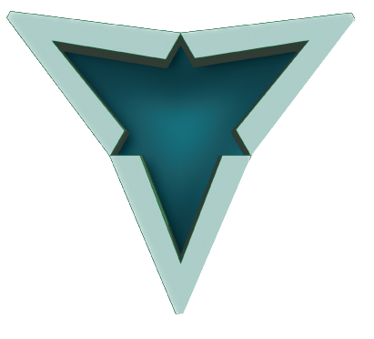

<header>
     

          
          
     

      
      
 

     <code align="center" font-size="12rem">Litt om meg.</code>
 

  
 </header>
 
<body>
Jeg har nå gått på IT-kurs i regi av Kodehode i over et halvt år. På denne tiden har jeg lært meg følgende verktøy:
Figma, React, Node, JS, Next i kombinasjon med TypeScript og Tailwind. På backend siden har vi vært innom SQL 
og C#. 
      
Interressene mine spenner fra fotografi og design, som jeg prøver å bruke en del tid på. Noe du kan se <a href="https://vidarheritier.myportfolio.com/work" target="_blank">her</a>
eller <a href="https://www.instagram.com/virvarart/" target="_blank">der</a>. Der jeg stort sett bruker Photoshop 
og Illustrator. Ellers er jeg glad i idrett og friluft, brett- og TV-spill, film og serier, god mat og ikke minst
venner og familie.
 
      
Mine styrker er nok i detaljene. Hvordan sider ser ut, navigeres og oppleves.
 
      

<pre align="center"><h6>Nå meg på</h6><h1 ><a href="mailto:vidarheritier&#64;gmail.com"> 📧 </a></h1><h6>med en gang</h6>
</pre>
</body>
 
      
 
      
     

